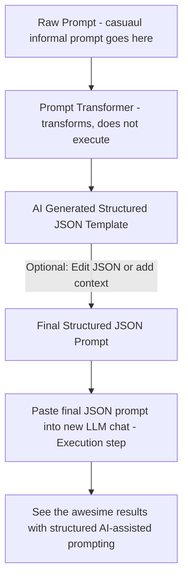

# Prompt Transformer and How it works


A simple **meta-prompting framework** that converts raw natural language requests into structured, reusable prompt templates.
Transform any raw prompt into a structured JSON format for **consistent AI interactions** and **predictable outputs** across any LLM.

---

## Overview

The Prompt Transformer is a **meta-prompt**  that takes unstructured user input and extracts key components—role, goals, constraints, and formatting requirements—into a **machine-readable JSON schema**.

* Build reliable **prompt libraries**
* Ensure **consistency, auditability, and reuse**
---

## Features

* **Structure Extraction** → Automatically identifies *Role, Goal, Audience, Context, and Constraints*
* **Format Standardization** → Enforces consistent JSON schema
* **Intelligent Inference** → Fills missing details with sensible defaults
* **Execution Prevention** → Focuses only on structure, not content generation
* **Zero Dependencies** → Works in any AI system (just copy the template)

---

## Workflow



**Figure:** The Prompt Transformer separates *prompt transformation* from *execution*.

---

## Quick Start

### 1. Copy and Customize

Use the following **template**. Replace `<USER_INPUT_HERE>` with your raw prompt:

```json
# USER INPUT
{
  "RawPrompt": "<USER_INPUT_HERE>"
}

# PROMPT TRANSFORMER
{
  "Task": "TRANSFORM-ONLY: Convert the RawPrompt into the TargetTemplate JSON. Do NOT execute or fulfill the RawPrompt.",
  "Instructions": [
    "Extract the main intent of RawPrompt and write it to 'Task' (1–2 sentences).",
    "Break specific requirements into 'Instructions' as imperatives.",
    "Derive 'Role' from the domain implied by RawPrompt (e.g., 'Email Assistant', 'Code Generator', 'Research Summarizer').",
    "Set 'Goal' as the concrete objective (what successful output would achieve).",
    "Set 'Audience' based on the scenario (e.g., 'Workplace professionals', 'Developers', 'General readers').",
    "Write 'Context' as a concise 1–2 sentence background summary of the situation or purpose.",
    "Set 'OutputFormat' to one of: 'text', 'code', 'JSON', 'markdown', 'table', 'outline'. If uncertain, use 'text'.",
    "Populate 'Constraints.Positive' and 'Constraints.Negative' with brief rules inferred from RawPrompt.",
    "Set 'Style' with 2–4 adjectives matching tone (default 'neutral, concise').",
    "Set 'CreativityLevel' to 'Low', 'Medium', or 'High' depending on the task.",
    "Set 'DataInput' to an empty string (\"\").",
    "If RawPrompt lacks information for any field, infer a safe, generic value.",
    "Output JSON only; no prose or domain-specific content."
  ],
  "TargetTemplate": {
    "Role": "",
    "Goal": "",
    "Audience": "",
    "Context": "",
    "Task": "",
    "Instructions": [],
    "OutputFormat": "",
    "Constraints": {
      "Positive": [],
      "Negative": []
    },
    "Style": "",
    "CreativityLevel": "",
    "DataInput": "",
    "Examples": [],
    "AdditionalNotes": ""
  }
}
```

---

### 2. Paste and Run

Copy the entire JSON into your LLM.
The model will transform your raw request into a **structured, reusable template**.

---

## Examples

### Example 1 – Professional Email

**Raw Prompt**

> Write an email to my manager asking for a day off next Friday.

**Output (JSON)**

```json
{
  "Role": "Email Assistant",
  "Goal": "Draft a professional email requesting a day off from work next Friday",
  "Audience": "Workplace manager",
  "Context": "The user wants to formally request a single day off from work.",
  "Task": "Write a polite email requesting a day off next Friday.",
  "Instructions": [
    "Address the email formally to the manager.",
    "Clearly state the request for leave on the specific date.",
    "Keep the message polite and concise."
  ],
  "OutputFormat": "text",
  "Constraints": {
    "Positive": ["Use professional tone", "Keep message short"],
    "Negative": ["Avoid unnecessary personal details", "Do not include casual slang"]
  },
  "Style": "polite, professional, concise",
  "CreativityLevel": "Low",
  "DataInput": "",
  "Examples": [],
  "AdditionalNotes": ""
}
```

---

### Example 2 – Travel Itinerary

**Raw Prompt**

> Plan a 3-day trip to Paris with sightseeing and local food recommendations.

**Output (JSON)**

```json
{
  "Role": "Travel Planner",
  "Goal": "Create a 3-day travel itinerary for Paris with sightseeing and food experiences",
  "Audience": "General travelers",
  "Context": "The user is planning a short trip to Paris and wants recommendations for attractions and food.",
  "Task": "Provide a structured 3-day itinerary for Paris.",
  "Instructions": [
    "Include morning, afternoon, and evening activities.",
    "Suggest popular landmarks such as the Eiffel Tower and Louvre.",
    "Add at least one local food or dining recommendation per day."
  ],
  "OutputFormat": "table",
  "Constraints": {
    "Positive": ["Include cultural and culinary highlights", "Ensure activities are tourist-friendly"],
    "Negative": ["Do not recommend overly expensive or niche activities"]
  },
  "Style": "informative, engaging, practical",
  "CreativityLevel": "Medium",
  "DataInput": "",
  "Examples": [],
  "AdditionalNotes": ""
}
```

---

## Tips

* Write raw prompts as **clearly as possible**.
* Always **review and tweak** the generated JSON.
* Adjust parameters for **granular control**.
* Reuse templates for **consistent results**.
* Works in **any LLM**.
* Pro tip → Use a snippet expander to quickly drop in the full transformer into any LLM chat
* Checkout a custom GPT that is baed on this https://chatgpt.com/g/g-68aea2a957a8819186af31f366b178df-baxter-prompt-butler-json 

---

## Roadmap

* [ ] Add more ready-to-use template variations
* [ ] Publish comparison benchmarks (raw vs structured prompts)
* [ ] Extend examples for enterprise and research use cases
* [ ] Integrate with downstream automation workflows

---

## License

MIT – free to use in any project. ⭐ Star the repo if you find it useful!

---

**Questions or Feedback?** Open an issue on GitHub.
